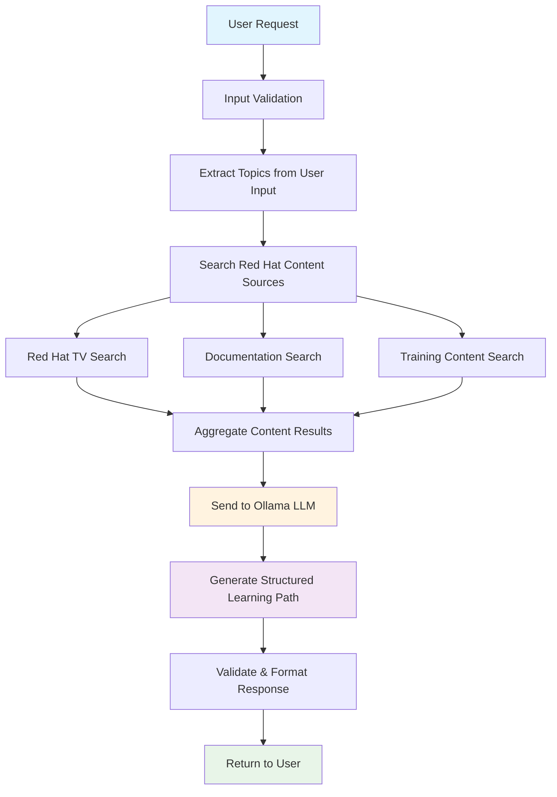

# Red Hat Learning Path Generator

An intelligent Node.js server that leverages **local Ollama LLM** to generate personalized Red Hat learning paths based on user interests and goals. The system searches through Red Hat's educational content including Red Hat TV, documentation, and training courses to create structured, progressive learning experiences.

> **🦙 Powered by Ollama** - Runs completely locally with your own LLM models, no external API keys required!

## 🔄 How It Works - Complete Workflow

The Red Hat Learning Path Generator follows a sophisticated workflow to create personalized learning experiences:

### 📊 System Architecture Overview

```
┌─────────────────┐    ┌─────────────────┐    ┌─────────────────┐
│   Client App    │───▶│   Express.js    │───▶│     Ollama      │
│  (Frontend)     │    │   REST API      │    │   (Local LLM)   │
└─────────────────┘    └─────────────────┘    └─────────────────┘
                               │
                               ▼
                    ┌─────────────────┐
                    │ Red Hat Content │
                    │    Services     │
                    └─────────────────┘
```

### 🔍 Detailed Workflow Process



### 🚀 Step-by-Step Process

#### 1. **Request Reception & Validation**
- User sends learning path request with profile data
- System validates input using Joi schema validation
- Extracts key information: interests, experience level, goals, time commitment

#### 2. **Content Discovery**
- **Topic Extraction**: AI analyzes user input to identify relevant Red Hat technologies
- **Multi-Source Search**: Simultaneously searches across:
  - 📺 **Red Hat TV**: Video content, webinars, demos
  - 📚 **Documentation**: Official product docs, guides, tutorials  
  - 🎓 **Training**: Courses, certifications, hands-on labs

#### 3. **AI-Powered Path Generation**
- **Ollama Integration**: Sends structured prompt to local LLM
- **Context-Aware Processing**: LLM analyzes user profile + available content
- **Intelligent Curation**: Creates progressive learning phases
- **Resource Prioritization**: Ranks content by relevance and difficulty

#### 4. **Response Structuring**
- **JSON Formatting**: Converts LLM output to structured format
- **Quality Validation**: Ensures response completeness
- **Metadata Addition**: Adds timestamps, source tracking, statistics

## 🚀 Features

- **🎯 Personalized Learning Paths**: AI-powered generation based on user profile and interests
- **🔍 Red Hat Content Integration**: Searches Red Hat TV, documentation, and training courses
- **🧠 Intelligent Content Curation**: LLM analyzes and organizes content by relevance and difficulty
- **🔌 Flexible API**: RESTful endpoints for easy integration with frontend applications
- **✅ Comprehensive Validation**: Request validation and error handling
- **📋 Structured Responses**: Well-organized learning paths with phases, resources, and assessments
- **🦙 Local AI Processing**: Complete privacy with local Ollama integration
- **⚡ High Performance**: Async processing and intelligent caching

## 📋 Prerequisites

- **Node.js 16.0.0 or higher**
- **Ollama installed locally** with a model (e.g., `llama3.2:latest`)
- **npm or yarn package manager**

### 🦙 Ollama Setup

1. **Install Ollama**: Visit [ollama.ai](https://ollama.ai) and install for your platform
2. **Pull a model**: 
   ```bash
   ollama pull llama3.2:latest  # Recommended model
   # Or try other models:
   # ollama pull llama2:13b
   # ollama pull mistral:7b
   ```
3. **Start Ollama**: 
   ```bash
   ollama serve  # Runs on http://localhost:11434 by default
   ```
4. **Verify installation**:
   ```bash
   ollama list  # Should show your installed models
   curl http://localhost:11434/api/version  # Test API access
   ```

## 🛠️ Installation

### Quick Start

```bash
# 1. Clone the repository
git clone <repository-url>
cd ollama-server

# 2. Install dependencies
npm install

# 3. Environment setup
cp env.example .env
# Edit .env with your configuration

# 4. Start the server
npm run dev  # Development mode with auto-restart
```

### Detailed Setup

1. **Clone the repository**
   ```bash
   git clone <repository-url>
   cd ollama-server
   ```

2. **Install dependencies**
   ```bash
   npm install
   ```

3. **Environment Configuration**
   ```bash
   cp env.example .env
   ```
   
   Edit `.env` file with your configuration:
   ```env
   # Ollama Configuration
   OLLAMA_HOST=http://localhost:11434
   OLLAMA_MODEL=llama3.2:latest
   
   # Server Configuration
   PORT=3000
   NODE_ENV=development
   
   # Rate Limiting
   RATE_LIMIT_WINDOW_MS=900000
   RATE_LIMIT_MAX_REQUESTS=100
   ```

4. **Start the server**
   ```bash
   # Development mode with auto-restart
   npm run dev
   
   # Production mode
   npm start
   ```

5. **Verify Setup**
   ```bash
   # Test server health
   curl http://localhost:3000/health
   
   # Test Ollama connection
   curl http://localhost:3000/api/learning-path/test-ollama
   
   # Check service status
   curl http://localhost:3000/api/learning-path/status
   ```

## 🔗 API Endpoints

### 🎯 Generate Learning Path
Create a personalized learning path based on user profile.

**POST** `/api/learning-path/generate`

**Request Body:**
```json
{
  "interests": ["OpenShift", "Kubernetes", "DevOps"],
  "experience": "intermediate",
  "goals": ["Become OpenShift administrator", "Learn container orchestration"],
  "timeCommitment": "6-10 hours/week",
  "preferredLearningStyle": "hands-on",
  "currentRole": "System Administrator",
  "industryFocus": "Technology",
  "certificationGoals": ["RHCSA", "OpenShift Admin"],
  "additionalContext": "Working with containerized applications"
}
```

**Response Structure:**
```json
{
  "learningPath": {
    "title": "OpenShift Administration Learning Path",
    "description": "Comprehensive path to become an OpenShift administrator",
    "totalEstimatedTime": "8-12 weeks",
    "difficultyLevel": "Intermediate",
    "prerequisites": ["Basic Linux knowledge", "Container concepts"],
    "learningObjectives": ["Master OpenShift administration", "Deploy applications"],
    "phases": [
      {
        "phase": 1,
        "title": "Foundation Phase",
        "description": "Build foundational OpenShift knowledge",
        "estimatedTime": "3 weeks",
        "difficulty": "Beginner",
        "resources": [
          {
            "title": "Introduction to OpenShift",
            "url": "https://tv.redhat.com/...",
            "type": "video",
            "source": "Red Hat TV",
            "duration": "45m",
            "priority": "High",
            "description": "Learn OpenShift basics and architecture"
          }
        ],
        "practiceActivities": ["Install OpenShift locally", "Deploy first application"],
        "assessmentCriteria": ["Complete hands-on labs", "Deploy sample app"]
      }
    ],
    "certificationPath": {
      "recommended": ["Red Hat Certified Specialist in OpenShift Administration"],
      "sequence": ["Complete foundation", "Hands-on practice", "Take certification"]
    },
    "nextSteps": ["Advanced OpenShift topics", "Multi-cluster management"]
  },
  "metadata": {
    "generatedAt": "2024-01-15T10:30:00.000Z",
    "userProfile": { /* user profile data */ },
    "contentSources": {
      "totalResources": 25,
      "tvVideos": 8,
      "documentation": 10,
      "training": 7
    },
    "extractedTopics": ["openshift", "kubernetes", "containers"]
  }
}
```

### 🔍 Search Red Hat Content
Search for specific topics across Red Hat content sources.

**POST** `/api/learning-path/search`

**Request Body:**
```json
{
  "topics": ["Ansible", "automation"],
  "sources": ["tv", "documentation", "training"]  // Optional, defaults to "all"
}
```

**Response:**
```json
{
  "results": {
    "tv": [/* Red Hat TV videos */],
    "documentation": [/* Documentation links */],
    "training": [/* Training courses */],
    "all": [/* Combined deduplicated results */]
  },
  "metadata": {
    "searchedAt": "2024-01-15T10:30:00.000Z",
    "topics": ["Ansible", "automation"],
    "totalResults": 15
  }
}
```

### 📚 Get Available Topics
Retrieve available topics, skill levels, and learning options.

**GET** `/api/learning-path/topics`

### 🧪 Test Ollama Connection
Test if Ollama is running and the model is available.

**GET** `/api/learning-path/test-ollama`

**Success Response:**
```json
{
  "status": "success",
  "message": "Ollama connection successful",
  "model": "llama3.2:latest",
  "host": "http://localhost:11434",
  "response": "Hello, Red Hat learning assistant ready!",
  "timestamp": "2024-01-15T10:30:00.000Z"
}
```

**Error Response:**
```json
{
  "status": "failed",
  "error": "Connection refused",
  "suggestions": [
    "Make sure Ollama is running: ollama serve",
    "Make sure model is installed: ollama pull llama3.2:latest",
    "Check if Ollama is accessible at: http://localhost:11434"
  ]
}
```

### 📊 Service Status
Check service health and availability.

**GET** `/api/learning-path/status`

## 📊 Request Validation

### Learning Path Generation Requirements
- **interests**: Array of 1-10 strings (required)
- **experience**: One of "beginner", "intermediate", "advanced", "expert" (required)
- **goals**: Array of 1-5 strings (required)
- **timeCommitment**: One of "1-2 hours/week", "3-5 hours/week", "6-10 hours/week", "10+ hours/week", "full-time" (required)
- **preferredLearningStyle**: One of "visual", "hands-on", "reading", "mixed" (required)
- **currentRole**: String, optional
- **industryFocus**: String, optional
- **certificationGoals**: Array of strings, optional
- **additionalContext**: String up to 500 characters, optional

### Content Search Requirements
- **topics**: Array of 1-10 topic strings (required)
- **sources**: Array of source types ["tv", "documentation", "training", "all"], defaults to ["all"] (optional)

## 🏗️ System Architecture

```
├── server.js                      # Express server & middleware setup
├── routes/
│   └── learningPath.js            # API route handlers
├── services/
│   ├── redhatContentService.js    # Red Hat content search & aggregation
│   └── llmService.js              # Ollama LLM integration & prompt engineering
├── middleware/
│   └── errorHandler.js            # Global error handling & logging
├── utils/
│   ├── logger.js                  # Winston structured logging
│   └── validation.js              # Joi request validation schemas
├── logs/                          # Application log files
├── env.example                    # Environment configuration template
└── example-requests.json          # API usage examples
```

### 🔄 Data Flow Architecture

```
User Request
     ↓
Input Validation (Joi)
     ↓
Topic Extraction (AI-powered)
     ↓
┌─────────────────────────────────────┐
│        Content Search Phase        │
├─────────────────────────────────────┤
│  ┌─────────┐  ┌─────────┐  ┌──────┐ │
│  │Red Hat  │  │  Docs   │  │Train-│ │
│  │   TV    │  │ Search  │  │ ing  │ │
│  └─────────┘  └─────────┘  └──────┘ │
└─────────────────────────────────────┘
     ↓
Content Aggregation & Deduplication
     ↓
┌─────────────────────────────────────┐
│         LLM Processing Phase        │
├─────────────────────────────────────┤
│  Ollama Local LLM                   │
│  ├─ Context Analysis               │
│  ├─ Learning Path Generation       │
│  └─ Content Prioritization         │
└─────────────────────────────────────┘
     ↓
Response Formatting & Validation
     ↓
Structured JSON Response
```

## 🔧 Configuration Options

| Environment Variable | Description | Default | Required |
|---------------------|-------------|---------|----------|
| `OLLAMA_HOST` | Ollama server URL | `http://localhost:11434` | No |
| `OLLAMA_MODEL` | Ollama model to use | `llama3.2:latest` | No |
| `PORT` | Server port | `3000` | No |
| `NODE_ENV` | Environment mode | `development` | No |
| `RATE_LIMIT_WINDOW_MS` | Rate limit window | `900000` (15 min) | No |
| `RATE_LIMIT_MAX_REQUESTS` | Max requests per window | `100` | No |

## 🚦 Usage Examples

### Basic Learning Path Generation
```javascript
const response = await fetch('http://localhost:3000/api/learning-path/generate', {
  method: 'POST',
  headers: {
    'Content-Type': 'application/json'
  },
  body: JSON.stringify({
    interests: ['OpenShift', 'Kubernetes'],
    experience: 'beginner',
    goals: ['Learn container orchestration'],
    timeCommitment: '3-5 hours/week',
    preferredLearningStyle: 'hands-on'
  })
});

const learningPath = await response.json();
console.log(learningPath);
```

### Content Search
```javascript
const response = await fetch('http://localhost:3000/api/learning-path/search', {
  method: 'POST',
  headers: {
    'Content-Type': 'application/json'
  },
  body: JSON.stringify({
    topics: ['Ansible', 'automation'],
    sources: ['tv', 'training']
  })
});

const searchResults = await response.json();
console.log(searchResults);
```

### cURL Examples
```bash
# Generate learning path
curl -X POST http://localhost:3000/api/learning-path/generate \
  -H "Content-Type: application/json" \
  -d '{
    "interests": ["OpenShift", "Kubernetes"],
    "experience": "beginner",
    "goals": ["Learn container orchestration"],
    "timeCommitment": "3-5 hours/week",
    "preferredLearningStyle": "hands-on"
  }'

# Test Ollama connection
curl http://localhost:3000/api/learning-path/test-ollama

# Check service status
curl http://localhost:3000/api/learning-path/status
```

## 🧪 Testing & Development

### Running Tests
```bash
# Run all tests
npm test

# Run tests with coverage
npm run test:coverage

# Run in watch mode during development
npm run test:watch
```

### Development Workflow
```bash
# Start in development mode (auto-restart on changes)
npm run dev

# Check logs
tail -f logs/combined.log

# Monitor Ollama
ollama ps  # Show running models
ollama logs  # Show Ollama logs
```

## 📝 Logging & Monitoring

The application uses **Winston** for structured logging:

### Log Files
- **`logs/error.log`**: Error-level messages only
- **`logs/combined.log`**: All log levels
- **Console output**: Development mode only

### Log Levels
- `error`: Error conditions requiring attention
- `warn`: Warning conditions that might need investigation
- `info`: General informational messages
- `debug`: Detailed debug information (development only)

### Sample Log Output
```json
{
  "level": "info",
  "message": "Generating learning path for user profile",
  "service": "redhat-learning-path-generator",
  "timestamp": "2024-01-15T10:30:00.000Z",
  "interests": ["OpenShift", "Kubernetes"],
  "experience": "beginner"
}
```

## 🔒 Security Features

- **🛡️ Helmet.js**: Security headers (XSS protection, content security policy)
- **🌐 CORS**: Cross-origin resource sharing protection with configurable origins
- **⏱️ Rate Limiting**: Request throttling to prevent abuse
- **✅ Input Validation**: Comprehensive request validation with Joi schemas
- **🔐 Error Sanitization**: Safe error responses without sensitive data exposure
- **📊 Request Logging**: Security event logging and monitoring

## 🚀 Deployment

### Production Deployment Checklist

1. **Environment Setup**
   ```bash
   export NODE_ENV=production
   export OLLAMA_HOST=http://your-ollama-server:11434
   export OLLAMA_MODEL=llama3.2:latest
   ```

2. **Security Configuration**
   - Configure proper CORS origins
   - Set up reverse proxy (nginx/Apache)
   - Enable HTTPS/TLS
   - Configure firewall rules

3. **Process Management**
   ```bash
   # Using PM2
   npm install -g pm2
   pm2 start server.js --name "redhat-learning-generator"
   pm2 startup
   pm2 save
   ```

4. **Monitoring Setup**
   - Configure log rotation
   - Set up health check monitoring
   - Configure alerting for service failures

### Docker Deployment
```dockerfile
FROM node:18-alpine

# Install Ollama (if running in same container)
RUN curl -fsSL https://ollama.ai/install.sh | sh

WORKDIR /app

# Copy package files
COPY package*.json ./
RUN npm ci --only=production

# Copy application code
COPY . .

# Create logs directory
RUN mkdir -p logs

# Expose port
EXPOSE 3000

# Health check
HEALTHCHECK --interval=30s --timeout=10s --start-period=5s --retries=3 \
  CMD curl -f http://localhost:3000/health || exit 1

# Start application
CMD ["npm", "start"]
```

### Docker Compose Setup
```yaml
version: '3.8'
services:
  ollama:
    image: ollama/ollama:latest
    ports:
      - "11434:11434"
    volumes:
      - ollama_data:/root/.ollama
    
  learning-path-generator:
    build: .
    ports:
      - "3000:3000"
    environment:
      - OLLAMA_HOST=http://ollama:11434
      - OLLAMA_MODEL=llama3.2:latest
      - NODE_ENV=production
    depends_on:
      - ollama
    restart: unless-stopped

volumes:
  ollama_data:
```

## 🔄 API Response Status Codes

| Status Code | Description | Common Causes |
|-------------|-------------|---------------|
| 200 | Success | Request processed successfully |
| 400 | Bad Request | Invalid input, validation failed |
| 429 | Too Many Requests | Rate limit exceeded |
| 500 | Internal Server Error | Unexpected server error |
| 503 | Service Unavailable | Ollama service down or model not available |

## 📈 Performance Considerations

### Optimization Strategies
- **🚀 Async Processing**: All content searches performed concurrently
- **📦 Response Caching**: Consider implementing Redis for frequently requested content
- **⚡ Rate Limiting**: Prevents API abuse and ensures fair usage
- **🔄 Connection Pooling**: Efficient Ollama connection management
- **📊 Request Batching**: Optimize multiple simultaneous requests

### Monitoring Metrics
- Response time per endpoint
- Ollama model inference time
- Content search performance
- Error rates and types
- Memory and CPU usage

## 🤝 Contributing

1. **Fork the repository**
2. **Create a feature branch**: `git checkout -b feature/amazing-feature`
3. **Make your changes** with proper tests
4. **Run the test suite**: `npm test`
5. **Commit your changes**: `git commit -m 'Add amazing feature'`
6. **Push to the branch**: `git push origin feature/amazing-feature`
7. **Open a Pull Request**

### Development Guidelines
- Follow existing code style and patterns
- Add tests for new functionality
- Update documentation for API changes
- Use meaningful commit messages
- Ensure all tests pass before submitting

## 🆘 Troubleshooting

### Common Issues

#### Ollama Connection Issues
```bash
# Check if Ollama is running
curl http://localhost:11434/api/version

# Check available models
ollama list

# Pull required model if missing
ollama pull llama3.2:latest

# Restart Ollama service
ollama serve
```

#### Server Startup Issues
```bash
# Check logs for errors
tail -f logs/combined.log

# Verify environment configuration
cat .env

# Test with minimal configuration
NODE_ENV=development npm start
```

#### Performance Issues
```bash
# Monitor system resources
top -p $(pgrep -f "node.*server.js")

# Check Ollama model memory usage
ollama ps

# Review log files for bottlenecks
grep "duration\|time" logs/combined.log
```

### Debug Mode
```bash
# Enable debug logging
DEBUG=* npm run dev

# Or specific debug categories
DEBUG=ollama,content-search npm run dev
```

## 📄 License

MIT License - see LICENSE file for details.

## 🙏 Acknowledgments

- **Red Hat** for providing comprehensive learning resources
- **Ollama** team for making local LLM deployment accessible
- **Node.js** and **Express.js** communities for robust frameworks
- All contributors and users of this project

---

**🚀 Ready to generate your Red Hat learning path?**

Start by ensuring Ollama is running with your preferred model, then fire up the server and begin creating personalized learning experiences!

```bash
# Quick start commands
ollama serve &
npm run dev
curl http://localhost:3000/api/learning-path/test-ollama
```

**Note**: This application provides curated Red Hat content data for demonstration. In a production environment, integrate with actual Red Hat APIs and content management systems for real-time content discovery and the most up-to-date learning resources.